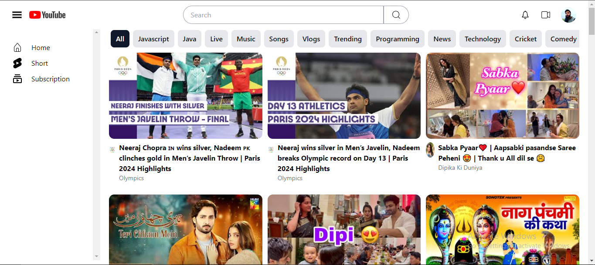
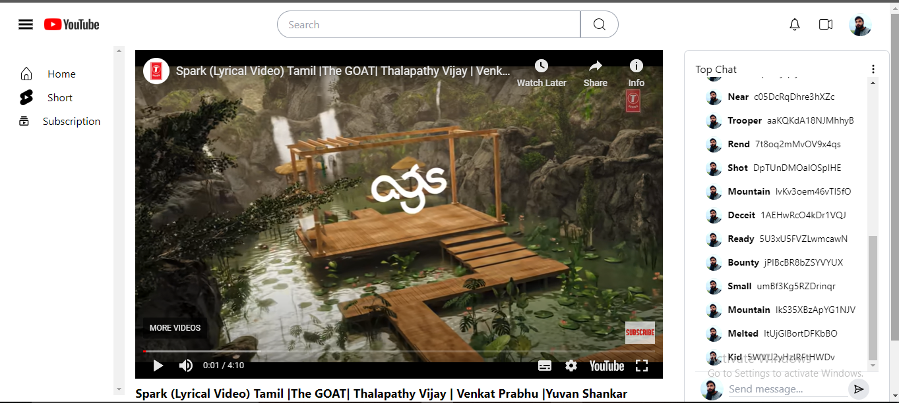
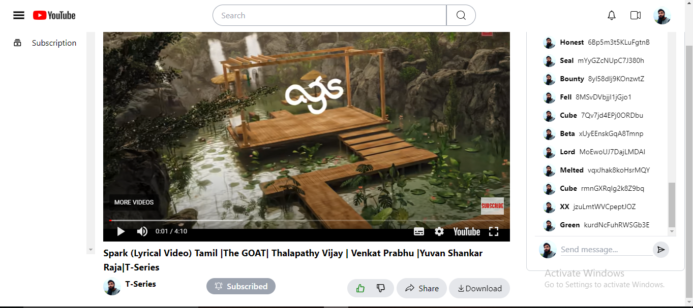

# YouTube Clone

A front-end only clone of YouTube built with React, Redux, and Tailwind CSS. This project aims to replicate the core functionalities of YouTube, providing users with an engaging video browsing experience.

## Table of Contents

- [Features](#features)
- [Technologies Used](#technologies-used)

## Features

- User-friendly interface for browsing and watching videos
- Search functionality to find videos
- Video details page with comments section
- Responsive design using Tailwind CSS
- State management with Redux for efficient data handling

## Technologies Used

- **React**: A JavaScript library for building user interfaces
- **Redux**: A predictable state container for JavaScript apps
- **Tailwind CSS**: A utility-first CSS framework for rapid UI development
- **React Router**: For navigation between different components
- **Axios**: For making HTTP requests to fetch video data

## UI

